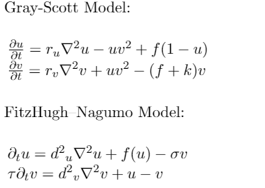

# DiffuseAnimals: Reaction-Diffusion Models for the Generation of Biological Patterns

## Introduction
Reaction-diffusion equations can be utilized in order to describe processes of non-chemical systems as well as those containing one or more chemical substances that exhibit diverse spatiotemporal patterns such as socioeconomic interactions, neutron diffusion, and biochemical reactions. Solutions to these equations can exhibit wave-like behavior as first described by Alan Turing in his 1952 article *The Chemical Basis of Morphogenesis*. Here, we explore the Gray-Scott and FitzHugh–Nagumo models in order to simulate the diversity of patterns found among species as observed on the skin, scales, and fur of animals and across the domains of life.

## [McGill Physics Hackathon](https://www.physics.mcgill.ca/hackathon/) 2021 Team Members:
* Ryan Senoune
* Austin J. Szuminsky
* Yuliya Shpunarska
* Xavier L'Heureux

## License
MIT
